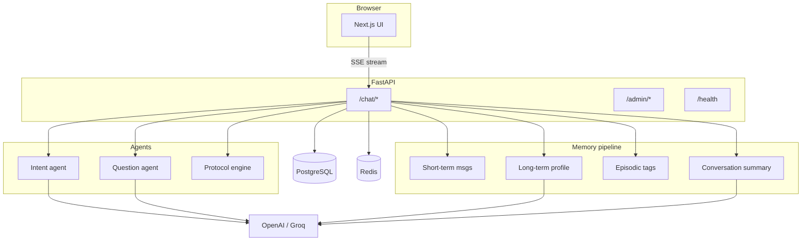

# AI Health Coach (Reeba)

WhatsApp-style **AI health coach** with a **FastAPI** backend, **PostgreSQL** memory, **Redis** (Upstash) caching, and **multi-agent** orchestration. The UI mimics **WhatsApp Web** on desktop and stays **responsive** on mobile (chat list ↔ conversation).

---

## Tech stack

| Layer | Technology |
|--------|------------|
| **Frontend** | Next.js 16 (App Router), React 19, TypeScript, Tailwind CSS v4, shadcn-style UI primitives |
| **Backend** | Python 3.12, FastAPI, Uvicorn |
| **Database** | PostgreSQL (Neon-compatible), SQLAlchemy 2.x, psycopg3 |
| **Cache / rate limit** | Redis via **Upstash** REST (`upstash-redis`) |
| **LLM (primary)** | OpenAI Chat Completions (streaming + JSON mode) |
| **LLM (fallback)** | Groq OpenAI-compatible API (`llama-3.3-70b-versatile`, streaming) |
| **Containers** | Docker, Docker Compose (`api` + `ui`) |

**Constraints:** No vector DB / embeddings. Episodic recall uses **PostgreSQL `tags` array overlap** + keyword extraction.

---

## High-level architecture



---

## Repository layout

```
AI-Health-Coach/
├── docker-compose.yml      # api + ui, env from server/.env
├── README.md               # this file
├── server/                 # FastAPI application
│   ├── main.py             # app entry, CORS, routers, lifespan → init_db
│   ├── config.py           # pydantic-settings (.env)
│   ├── db/
│   │   ├── models.py       # SQLAlchemy models
│   │   └── session.py      # engine, get_db, init_db (create_all)
│   ├── chat/               # HTTP + SSE streaming
│   │   ├── router.py       # GET messages, POST stream, PATCH feedback
│   │   ├── service.py      # orchestration: save → context → intent → protocol → UI → LLM stream
│   │   └── prompts.py      # system prompt (safety + profile + summary + episodic + protocol)
│   ├── agents/
│   │   ├── intent.py       # JSON: intent, entities, urgency
│   │   ├── onboarding_agent.py  # JSON onboarding until COMPLETED
│   │   ├── question_agent.py  # scales (anxiety/fever) + LLM chip choices
│   │   ├── memory_extraction.py  # legacy helper (not on hot path)
│   │   └── schemas.py      # Pydantic I/O models
│   ├── protocol/
│   │   └── engine.py       # rule-based triage (emergency, fever, …)
│   ├── onboarding/         # ensure user, progress JSON, merge → user_memory
│   ├── memory/
│   │   ├── schemas.py      # LongTermExtracted, MemoryContext
│   │   ├── long_term.py    # LLM extract + merge + user_memory upsert
│   │   ├── episodic.py     # keyword store + tag overlap retrieval
│   │   ├── summary.py      # rolling summary → conversation_summary
│   │   ├── retrieval.py    # build_memory_context + Redis profile/summary
│   │   └── tasks.py        # post-turn background work
│   ├── llm/
│   │   └── client.py       # JSON completion + streaming w/ fallback
│   ├── streaming/
│   │   └── sse.py          # SSE framing
│   ├── admin/              # user overview + agent prompts (open in dev)
│   └── redis_client.py     # msgs cache, rate limit, profile:/summary: keys
└── ui/                     # Next.js
    └── src/
        ├── app/            # /, /admin, /health
        └── components/chat/# WhatsApp shell + Reeba panel + interactive widgets
```

---

## Database schema (PostgreSQL)

### `messages`

| Column | Type | Notes |
|--------|------|--------|
| `id` | bigserial | PK |
| `user_id` | varchar(128) | Stable client id |
| `role` | varchar | `user` / `assistant` |
| `content` | text | Truncated server-side if over limit |
| `created_at` | timestamptz | |
| `user_feedback` | varchar(16) | Optional `up` / `down` |

### `users`

| Column | Type | Notes |
|--------|------|--------|
| `user_id` | varchar(128) | PK (same id as chat client) |
| `onboarding_status` | varchar | `NOT_STARTED` \| `IN_PROGRESS` \| `COMPLETED` |
| `created_at` / `updated_at` | timestamptz | |

### `onboarding_progress`

| Column | Type | Notes |
|--------|------|--------|
| `user_id` | varchar(128) | PK, FK → `users.user_id` |
| `collected_fields` | jsonb | `goal`, `conditions`, `lifestyle` during onboarding |
| `updated_at` | timestamptz | |

### `user_memory` (long-term profile)

| Column | Type | Notes |
|--------|------|--------|
| `user_id` | varchar(128) | PK |
| `profile` | jsonb | age, gender, name, goals, conditions, preferences, **lifestyle** |
| `updated_at` | timestamptz | |

### `episodic_memory`

| Column | Type | Notes |
|--------|------|--------|
| `id` | serial | PK |
| `user_id` | varchar(128) | indexed |
| `content` | text | User utterance (deduped) |
| `tags` | varchar[] | Keywords / time phrases for `&&` overlap |
| `created_at` | timestamptz | |

### `conversation_summary`

| Column | Type | Notes |
|--------|------|--------|
| `user_id` | varchar(128) | PK |
| `summary` | text | Rolling compressed history |
| `updated_at` | timestamptz | |

### Legacy `memory` (optional)

Older JSON rows (`profile` / `summary` / `episodic`) may still exist; new code prefers the tables above. Admin can show **legacy_memory_rows** for debugging.

**ORM:** `Base.metadata.create_all()` on startup (no Alembic in-repo; use migrations in production as needed).

---

## Memory system (layers)

1. **Short-term** — Last *N* messages from `messages` (Redis cache key `coach:msgs:{user_id}`).
2. **Long-term** — Merged JSON profile in `user_memory`; extracted from user text via LLM JSON; **merge** never overwrites with `null`; arrays are set-union.
3. **Summary** — `conversation_summary`; refreshed every **N** user messages (config); LLM merges old summary + recent transcript.
4. **Episodic** — Inserts when **keyword rules** match (symptoms, habits, emotions, time phrases). **Retrieval:** `tags && query_keywords` (up to 5); if no hit, last 3 episodic rows.

**`build_memory_context(session, user_id, current_message)`** returns a tuple:

- **`MemoryContext`** — `recent_messages` (slice for future use / debugging), `summary`, `profile`, `episodic` (strings).
- **Full short-term list** — same rows as loaded once from DB/Redis for the main LLM (avoids a duplicate fetch).

Used to build the **system prompt** before streaming.

**Post-turn (async):** After a **successful** SSE transaction commit, `BackgroundTasks` runs `run_post_chat_memory_work`: long-term apply, episodic insert, optional summary refresh, then **invalidates** message + `profile:` + `summary:` Redis keys.

---

## Redis keys

| Key pattern | Purpose | TTL |
|-------------|---------|-----|
| `coach:msgs:{user_id}` | Cached recent message list (JSON) | `llm_cache_ttl_seconds` (~5 min) |
| `profile:{user_id}` | Cached profile JSON | `memory_cache_ttl_seconds` (~7 min) |
| `summary:{user_id}` | Cached summary text | same |
| `coach:rl:{user_id}:{minute}` | Rate limit counter | ~70 s |
| `coach:inflight:{user_id}:{client_request_id}` | Dedupe concurrent identical client id | 120 s |
| `coach:aprompt:{key}` | Cached agent system prompt text | short TTL |

---

## LLM models: who uses what (and why)

Model names come from **environment** (`OPENAI_MODEL`, `GROQ_MODEL` in `server/.env`; see `server/.env.example`). **Primary** provider is OpenAI when `OPENAI_API_KEY` is set; **Groq** (OpenAI-compatible client, default **Llama 3.3 70B Versatile**) is used if OpenAI errors or is unset.

| Component | Provider call | Typical default model | Why this setup |
|-----------|----------------|----------------------|----------------|
| **Main coach reply** (streaming) | `LLMClient.stream_assistant` | `gpt-4.1-mini` (or your `OPENAI_MODEL`) | Fast GPT-4.1-class mini; good for conversational coaching; streaming keeps the UI responsive. |
| **Intent classifier** | `complete_json_chat` | Same stack | Small JSON schema (`intent`, `entities`, `urgency`); OpenAI JSON mode or Groq with JSON / plain parse fallback. |
| **Question agent** (quick-reply chips) | `complete_json_chat` | Same | Only for `health_query` / `onboarding` when not using anxiety/fever scales; short JSON, same stack as intent. |
| **Long-term profile extract** (post-turn, background) | `complete_json_chat` | Same | Runs after the user message is saved; occasional JSON extract into `user_memory`. |
| **Rolling conversation summary** (background) | `complete_json_chat` | Same | Throttled (every *N* user messages); merges prior summary + recent lines into one JSON `summary`. |
| **Protocol engine** | — | *no LLM* | Rule-based triage for speed and determinism. |
| **Episodic store** | — | *no LLM* | Keyword/tags + Postgres overlap query. |

**Choosing models:** default OpenAI is `gpt-4.1-mini` (`OPENAI_MODEL`). Fallback is `GROQ_MODEL=llama-3.3-70b-versatile` when `GROQ_API_KEY` is set. JSON agents follow the same OpenAI → Groq order.

---

## Performance (server)

Slowness usually comes from **(1)** multiple sequential LLM round-trips per message and **(2)** **Upstash REST** = one HTTP request per Redis command.

This repo reduces hot-path latency by:

- **Overlapping** the **intent** LLM call with **memory context** loading (DB + Redis) on a small thread pool.
- **One** short-term message load per turn (returned with `MemoryContext` for the main LLM) instead of two identical cache/DB passes.
- **Reused OpenAI + Groq HTTP clients** (OpenAI SDK with Groq `base_url`; connection pooling).
- **In-process cache** for agent prompt strings after first resolve (still invalidated on admin prompt edits; Redis remains optional cross-instance layer).
- **Startup `warm_agent_prompts()`** so the first chat turn does not cold-load every prompt from Redis/DB.
- **Quieter `httpx` / `httpcore` logs** (WARNING) so Docker logs are readable.

Further gains (if you need them): use **local Redis** (TCP, pipelines) instead of REST; add a **cheaper/faster** `OPENAI_MODEL`; or **skip** the question-agent LLM for more intents (trade UX for speed).

---

## Agents and interactions

### 1. Intent agent (`agents/intent.py`)

- **Input:** latest user message.  
- **Output (JSON):** `intent` (`health_query` | `casual` | `emergency` | `onboarding`), `entities[]`, `urgency`.  
- **Uses:** `complete_json_chat` → OpenAI JSON, fallback Groq.

### 2. Protocol engine (`protocol/engine.py`)

- **Rule-based** (no LLM): patterns for emergency, fever, headache, etc.  
- **Output:** `protocol`, `response_hint`, `priority`.  
- If **emergency / high**, intent is **forced** to `emergency` before the response model runs.

### 3. Question agent (`agents/question_agent.py`)

- **Anxiety / fever** keywords → **scale** UI (0–10) in SSE `ui` event.  
- Else **health / onboarding** → LLM proposes up to **4 chip choices** or `none`.  
- **Output:** structured `QuestionAgentOutput` sent as SSE `type: "ui"`.

### 4. Response (streaming “agent”)

- **Not** a separate JSON agent on the hot path: the **main LLM** streams natural language using `build_system_prompt(preamble, profile, summary, episodic, intent, protocol)` (preamble from DB-backed `coach_system_preamble`).

### 2b. Onboarding (`agents/onboarding_agent.py` + `onboarding/`)

- While `users.onboarding_status` ≠ **`COMPLETED`**, the chat routes to the **onboarding JSON agent** (one question at a time) instead of the main coach stream — **unless** intent/protocol indicate **emergency** (normal coach path for safety).  
- **`onboarding_progress.collected_fields`** stores partial `goal` / `conditions` / `lifestyle`. On completion, values merge into **`user_memory.profile`** and status becomes **`COMPLETED`**.  
- Prompt DB key **`onboarding_agent`** (seeded like other agent prompts). After completion, `build_system_prompt` adds a short **Goal / Conditions / Lifestyle** personalization block when those fields exist.

### Interaction order (per user message)

1. Ensure **`users`** + **`onboarding_progress`** rows → persist **`messages`** user row → SSE **`meta`** (includes **`onboarding`** status).  
2. Invalidate message list cache → start **intent** LLM on a **background thread** and, in parallel, **`build_memory_context`**.  
3. **Join** intent → **Protocol** + intent boost.  
4. If onboarding **active** and not emergency → **onboarding agent** → SSE **`ui`** (empty interactive) → single assistant reply → **`done`** (skip main stream; background memory task skipped for that turn).  
5. Else **Question agent** → SSE **`ui`**.  
6. **Stream** tokens with OpenAI, fallback Groq.  
7. Persist assistant row → SSE **`done`** (includes updated **`onboarding`** when applicable).  
8. **Background:** long-term, episodic, summary throttle; cache invalidation (skipped when `skip_memory` is set).

---

## API surface (FastAPI)

| Method | Path | Description |
|--------|------|-------------|
| GET | `/health` | DB + Redis ping |
| GET | `/chat/messages` | Paginated history (`user_id`, `before_id`, `limit`) |
| POST | `/chat/stream` | JSON body: `content`, optional `user_id`, `client_request_id` → **SSE** (`meta`, `ui`, `token`, `done`) |
| PATCH | `/chat/messages/{id}/feedback` | Body `{ "vote": "up" \| "down" }` |
| GET | `/admin/users` | Distinct `user_id` values |
| GET | `/admin/users/{user_id}/overview` | Profile, summary, episodic, legacy rows, messages |
| GET | `/admin/prompts` | List agent prompt keys |
| GET | `/admin/prompts/{key}` | Full prompt text |
| PATCH | `/admin/prompts/{key}` | Body `{ "content": "..." }` |

OpenAPI: `/docs`.

---

## Frontend (UI)

- **`/`** — WhatsApp-style **desktop** layout: **left chat list** + **right conversation** (max width ~1680px, centered shadow on large screens).  
- **Mobile (`<768px`):** **Chats** list full screen → tap **Health Coach Reeba** opens conversation; **back** returns to list.  
- **Other contacts** are **demo rows** (“View only”); tap shows a toast — **only Reeba** talks to the API.  
- **SSE** parsing for streaming text + interactive scales/chips.  
- **`/admin`** — user overview + editable agent prompts (no auth in this personal build).  
- **`/health`** — backend status widget.

**Env (UI):** `ui/.env` (see `ui/.env.example`). Set **`NEXT_PUBLIC_API_URL`** to the FastAPI base URL (no trailing slash), e.g. `http://localhost:8000`. Next.js inlines this at **build** time for client bundles; Docker uses the `NEXT_PUBLIC_API_URL` **build arg** in `docker-compose.yml`.

---

## Configuration (server `.env`)

See `server/.env.example`. Important keys:

- `DATABASE_URL` — PostgreSQL (e.g. Neon, `sslmode=require`).  
- `UPSTASH_REDIS_REST_URL`, `UPSTASH_REDIS_REST_TOKEN`  
- `CORS_ORIGINS` — comma-separated browser origins  
- `OPENAI_API_KEY` and/or `GROQ_API_KEY` (at least one for chat; Groq is fallback)  

Tunable in `config.py`: message limits, summary interval, rate limits, cache TTLs.

---

## Run locally

**API**

```bash
cd server
python -m venv .venv && source .venv/bin/activate
pip install -r requirements.txt
cp .env.example .env   # fill values
uvicorn main:app --reload --port 8000
```

**UI**

```bash
cd ui
npm install
cp .env.example .env   # edit NEXT_PUBLIC_API_URL if the API is not on localhost:8000
npm run dev
```

**Docker**

```bash
docker compose up --build
```

Ensure `server/.env` exists for the API container (`env_file` in Compose).

### Railway (production)

Two services (**API** + **UI**), Postgres, Upstash Redis, and env vars including **`CORS_ORIGINS`** and UI **`NEXT_PUBLIC_API_URL`** at build time. If Docker fails with **`requirements.txt` not found**, set the API service **Root Directory** to **`server`**, or use root **`Dockerfile.api`**. Details: **[docs/railway.md](docs/railway.md)**.

---

## Guardrails & safety (`server/guardrails/`)

| Module | Role |
|--------|------|
| `input_validation.py` | `sanitize_input`, `prepare_user_message`, `sanitize_prompt` (length, printable text, repeat collapse, injection phrases) |
| `safety_rules.py` | `check_safety` — emergency / self-harm / medication keyword overrides (no LLM) |
| `output_filter.py` | `filter_output` — post-LLM block on dosage / prescribing patterns before DB persist |
| `rate_limiter.py` | `check_rate_limit` (Redis `rate:{user_id}:{minute}`, default **10/min**), `check_duplicate_message` |
| `llm_wrapper.py` | `safe_json_completion`, `safe_stream_assistant`, `safe_llm_call` — retries + OpenAI → Groq fallback |
| `exceptions.py` | Shared guardrail exception types |

`/chat/stream` applies: prepare → rate limit → duplicate check → (persist user) → safety override short-circuit → intent/memory → stream via wrapper → `filter_output` on stored assistant text. Background memory work is skipped for sanitization/safety short-circuits and some error paths (`capture["skip_memory"]`). Env: `GUARDRAIL_MAX_MESSAGE_CHARS`, `GUARDRAIL_RATE_LIMIT_PER_MINUTE`, `GUARDRAIL_JSON_RETRIES`.

---

## Security notes

- **`/admin/*` is unauthenticated** in this repo (personal use). Add middleware or a reverse-proxy secret before exposing the API on the internet.  
- **Do not** commit `server/.env`.  
- Coach copy is **non-diagnostic**; protocol layer escalates **emergency** language.  
- User IDs are client-generated (localStorage) unless you add real auth.

---

## Extending the system

- Add **auth** (JWT / session) and map `user_id` to real users.  
- Add **Alembic** for migrations.  
- Extend **protocol** rules or **question agent** templates.  
- Wire **demo contacts** to real rooms by adding backend threads and `user_id` / `conversation_id` routing.

---

## License

Private / project default — set as needed for your org.
