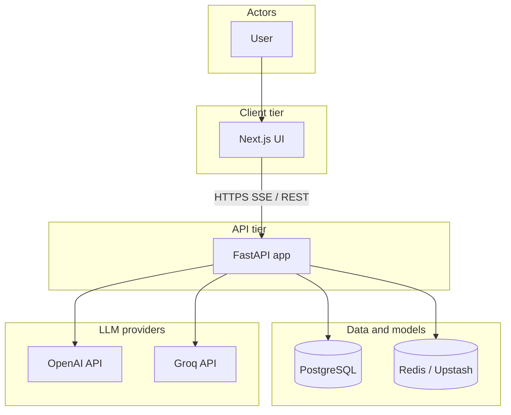
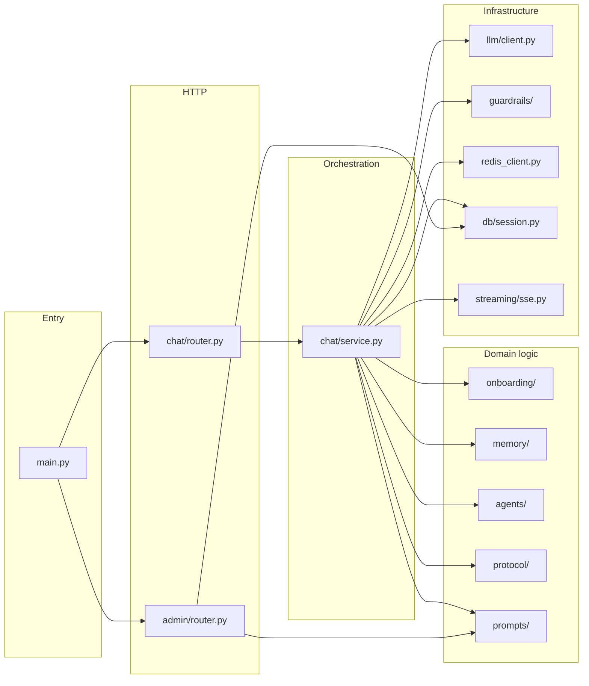
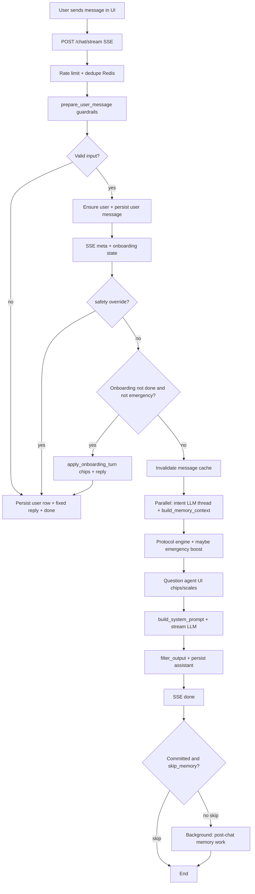
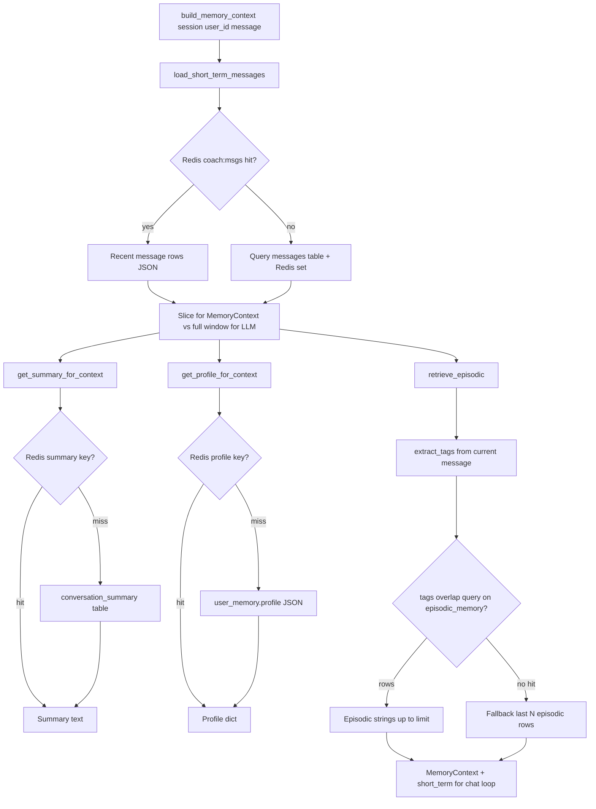
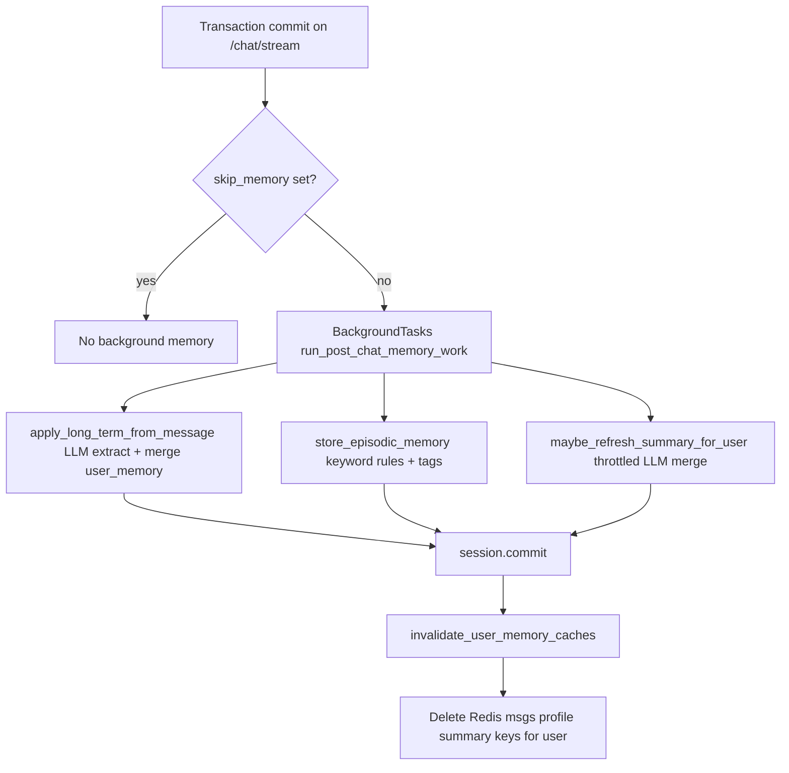
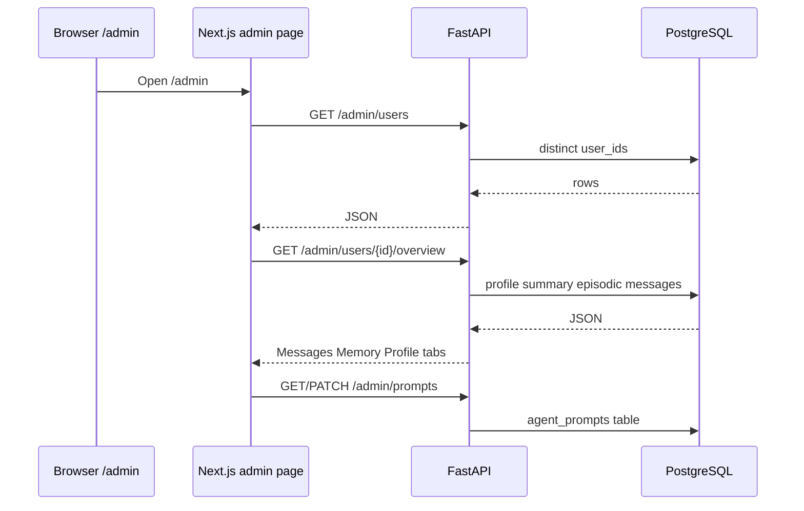

# AI Health Coach (Reeba)

WhatsApp-style **AI health coach**: **FastAPI** backend, **PostgreSQL** persistence, **Redis** (Upstash) for cache and rate limits, **Next.js** UI with streaming chat. No vector DB—episodic recall uses **Postgres tag overlap** and keywords.

---

## System design: HLD, LLD, and flows

### High-level design (HLD)

System context: who talks to what, and which external services the API depends on.



### Low-level design (LLD)

Major **Python packages** under `server/` and how the chat path wires them (simplified).



### User flow: send a message (end-to-end)

From the browser through guardrails, branching (onboarding vs coach), streaming, and post-reply work.



### Memory flow: read path (same turn as the coach)

How **short-term**, **profile**, **summary**, and **episodic** data are assembled for `build_system_prompt` (inside `build_memory_context` → `memory/retrieval.py`).



### Memory flow: write path (after a successful turn)

Runs only when the stream **commits** and **`skip_memory`** was not set (`chat/router.py` → `memory/tasks.py`).



### Admin / observability flow

Operators use the same API origin as the chat client.



---

## How to run it locally (step by step)

### 1. Prerequisites

- [Docker](https://docs.docker.com/get-docker/) (for Compose), **or** Python 3.12 + Node 20 for dev servers  
- A **PostgreSQL** URL (e.g. [Neon](https://neon.tech) free tier) **or** use the optional in-Docker Postgres below  
- An **[Upstash Redis](https://upstash.com)** REST database (free tier) — URL + token  
- At least one LLM key: **`OPENAI_API_KEY`** and/or **`GROQ_API_KEY`** (Groq is fallback)

### 2. Server environment

```bash
cp server/.env.example server/.env
```

Edit `server/.env`: set `DATABASE_URL`, `UPSTASH_REDIS_REST_*`, `CORS_ORIGINS` (include `http://localhost:3000`), and your LLM keys. There is **no Anthropic** integration in this repo; use OpenAI and/or Groq.

### 3. UI environment (API base URL)

The UI reads the FastAPI base URL from **`NEXT_PUBLIC_API_URL`** (no trailing slash).

```bash
cd ui
cp .env.example .env.local
# or: cp .env.local.example .env.local
```

Edit `ui/.env.local` if the API is not at `http://localhost:8000`.  
`src/lib/api.ts` uses `process.env.NEXT_PUBLIC_API_URL` with a localhost default.

### 4. Run with Docker Compose (API + UI)

From the **repository root**:

```bash
docker compose up --build
```

- **API:** [http://localhost:8000](http://localhost:8000) (`/docs` for OpenAPI)  
- **UI:** [http://localhost:3000](http://localhost:3000)  

Compose loads **`server/.env`** into the API container. The UI image is built with `NEXT_PUBLIC_API_URL=http://localhost:8000` (see `docker-compose.yml` build args). If you change the API port or use a tunnel, rebuild the UI with the correct build arg or run the UI with `npm run dev` and `.env.local` instead.

**Optional — Postgres only in Docker** (you still configure Upstash + LLM in `server/.env`):

```bash
docker compose -f docker-compose.yml -f docker-compose.localdb.yml up --build
```

This adds a `db` service and sets `DATABASE_URL` for the API to that container. Data persists in the `coach_pg_data` volume.

### 5. Run without Docker (development)

**API**

```bash
cd server
python -m venv .venv && source .venv/bin/activate   # Windows: .venv\Scripts\activate
pip install -r requirements.txt
# server/.env already filled
uvicorn main:app --reload --port 8000
```

**UI**

```bash
cd ui
npm install
# .env.local with NEXT_PUBLIC_API_URL=http://localhost:8000
npm run dev
```

---

## Database: migrations and seed

- **Migrations:** There is **no Alembic** (or other migration runner) in this project. On API startup, **`init_db()`** runs **`Base.metadata.create_all()`** so tables match SQLAlchemy models (`server/db/models.py`). For production you may add Alembic later; until then, schema changes require compatible `create_all` or manual SQL.
- **Seed:** **`seed_prompts_if_needed()`** runs at startup (`server/prompts/service.py`). Missing rows in **`agent_prompts`** are filled from defaults in `server/prompts/defaults.py` (coach preamble, intent, question agent, onboarding copy, etc.). **User/chat data is not seeded** — it appears when you use the app.

---

## Environment variables

| Area | File | Important variables |
|------|------|---------------------|
| **API** | `server/.env` (see `server/.env.example`) | `DATABASE_URL`, `UPSTASH_REDIS_REST_URL`, `UPSTASH_REDIS_REST_TOKEN`, `CORS_ORIGINS`, `OPENAI_API_KEY`, `OPENAI_MODEL`, `GROQ_API_KEY`, `GROQ_MODEL` |
| **UI** | `ui/.env.local` or `ui/.env` (see `ui/.env.example`, `ui/.env.local.example`) | `NEXT_PUBLIC_API_URL` — FastAPI origin the **browser** will call |

Optional guardrail tuning: `GUARDRAIL_MAX_MESSAGE_CHARS`, `GUARDRAIL_RATE_LIMIT_PER_MINUTE`, `GUARDRAIL_JSON_RETRIES` (documented in `.env.example`).

---

## Architecture overview (backend)

See **[System design: HLD, LLD, and flows](#system-design-hld-lld-and-flows)** for diagrams. In one pass: **`chat/router.py`** applies Redis rate limit / dedupe, **`chat/service.py`** orchestrates onboarding vs parallel **intent + `build_memory_context`**, **protocol**, **question UI**, **`build_system_prompt`**, and **streaming**; **`memory/tasks.py`** updates long-term / episodic / summary after commit. **`admin/router.py`** serves user overview and **`agent_prompts`** CRUD.

---

## Design decisions (short)

- **SSE streaming** for perceived latency; tokens arrive incrementally in the UI.  
- **Intent + memory load in parallel** (thread pool) to shave sequential LLM/DB time.  
- **Protocol layer is non-LLM** so emergency and triage hints stay predictable.  
- **Onboarding is mostly deterministic** (goal / conditions / lifestyle via chips and a small state machine) so first-run is fast and stable; results merge into **`user_memory`**.  
- **Long-term profile** is JSON merged with “no clobber from null” and set-union for list fields.  
- **Episodic memory** avoids embeddings: keyword tagging + **`tags && query_keywords`** in SQL, with a small fallback window.  
- **Redis** (Upstash REST) for message list cache, profile/summary cache, rate limit, prompt cache, inflight dedupe — failures degrade to “no cache” or fail-open rate limit where implemented.  
- **OpenAI first, Groq-compatible fallback** (`llm/client.py`, `guardrails/llm_wrapper.py`) for resilience and cost/speed experiments.

---

## LLM: provider and prompting

- **Providers:** Primary **OpenAI** Chat Completions (streaming + JSON-style tasks). **Groq** (OpenAI-compatible HTTP API) when OpenAI is missing or errors. Model names from env (`OPENAI_MODEL`, `GROQ_MODEL`; defaults in `server/config.py` and `.env.example`).  
- **Where the LLM runs:** Intent classification (JSON), question/chip suggestions for some intents, main coach **stream**, background **profile extraction** and **conversation summary** merge.  
- **Prompt assembly:** The live coach uses **`build_system_prompt`** (`chat/prompts.py`): DB-resolved **preamble** (`coach_system_preamble`), optional **goal/conditions/lifestyle** block, structured **profile** JSON, **summary**, **episodic** bullet list, **intent** + **entities**, and **protocol** hint. Agent-specific system text (intent, question, onboarding, etc.) is loaded from **`agent_prompts`** via `prompts/service.py` (seeded defaults, editable in UI).

---

## Trade-offs and “If I had more time…”

- **No Alembic** — fast to ship; production schema evolution should move to migrations.  
- **Upstash REST** — simple hosting, but one HTTP round-trip per Redis command; local TCP Redis would be faster at scale.  
- **No auth on `/admin`** — fine for local demos; needs middleware or network policy before public deploy.  
- **Client-generated `user_id`** — swap for real auth and server-issued IDs when you add accounts.  
- **Embeddings / vector recall** were out of scope; keyword + tag overlap is a deliberate ceiling on recall quality.  
- Could add **E2E tests**, **structured logging**, **per-conversation threads** in the UI, and **cheaper/smaller models** for intent-only calls.

---

## Frontend: chat, admin, prompts, memory

- **`/`** — WhatsApp-style shell; only **Reeba** talks to the API. Streaming text, scales, and quick-reply chips from SSE.  
- **`/admin`** — Two areas: **Users** (pick a `user_id`) and **Agent prompts**.  
  - **Users:** Tabs for **Messages**, **Memory** (episodic list + legacy memory rows), and **Profile** (structured `user_memory`).  
  - **Agent prompts:** List keys, edit body, save — changes apply on the next LLM call that loads that key.  
- **`/health`** — Calls the API health endpoint (DB + Redis).  

All browser calls use **`NEXT_PUBLIC_API_URL`** from env (`@/lib/api`).

---

## Docker notes

- Default API image is built from the repo root: **`Dockerfile.api`** (so `server/requirements.txt` paths resolve).  
- **`server/Dockerfile`** expects build context **`server/`** (e.g. Railway root directory `server`).  
- Details: **[docs/railway.md](docs/railway.md)**.

---

## Reference

| Method | Path | Purpose |
|--------|------|---------|
| GET | `/health` | DB + Redis checks |
| GET | `/chat/messages` | Paginated history |
| POST | `/chat/stream` | SSE chat |
| PATCH | `/chat/messages/{id}/feedback` | Thumbs up/down |
| GET | `/admin/users`, `/admin/users/{id}/overview` | Admin user inspect |
| GET/PATCH | `/admin/prompts`, `/admin/prompts/{key}` | Prompt manager |

**Guardrails** (`server/guardrails/`): input sanitization, safety keyword short-circuit, output filter, rate limit, LLM retry + fallback.

**Security:** Do not commit `server/.env`. Coach copy is non-diagnostic; protocol layer escalates emergency language.

---

## License

Private / project default — set as needed for your org.
